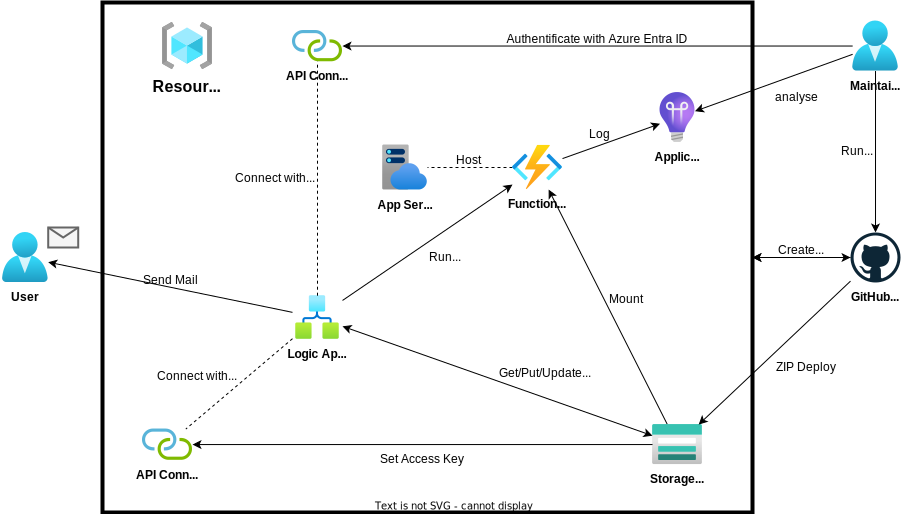
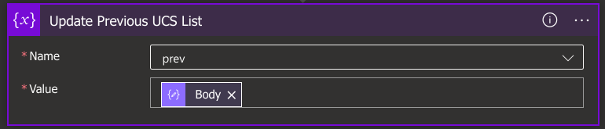
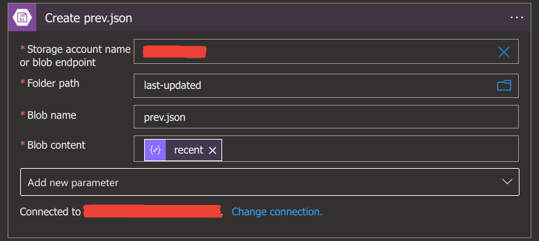

# Developer's Guide

## Installation

1. Install at your local environment as follows:
   - [Node.js](https://nodejs.org) (Over v20.x.x)
   - [Azure Functions Core Tools](https://learn.microsoft.com/en-us/azure/azure-functions/functions-run-local) (Over v4.x)
2. Fork this repository and clone it.
3. Move to `functions` directory and install NPM packages as follows:
   ```bash
   cd functions
   npm i
   ```
4. Create a new json file at `functions` directory named local.settings.json whose content is:
   ```json
   {
     "IsEncrypted": false,
     "Values": {
       "FUNCTIONS_WORKER_RUNTIME": "node"
     }
   }
   ```

## Development

TODO

## NPM Package Version

| Name       | Ver.    |
| ---------- | ------- |
| Node.js    | 20.10.0 |
| Playwright | 1.40.1  |
| Typescript | 5.1.6   |

> [!NOTE]
> All npm packages except above are maintained by dependabot in every Monday at 1:00(UTC).

## Azure Architecture



| Type                 | Name                             | Description                                           |
| -------------------- | -------------------------------- | ----------------------------------------------------- |
| Resource Group       | `AZURE_RESOURCE_GROUP`           | Resource Group with All Resources                     |
| Logic Apps           | `AZURE_LOGIC_APP`                | Run Functions Apps and Save Recent UCS per 6 hours    |
| API Connection       | `AZURE_API_CONNECTION_AZUREBLOB` | Logic Apps Connection with BLOB Storage               |
| API Connection       | `AZURE_API_CONNECTION_OUTLOOK`   | Logic Apps Connection with Outlook.com                |
| Functions App        | `AZURE_FUNCTIONS`                | Trace and Notificate Recent UCS                       |
| App Service Plan     | `AZURE_FUNCTIONS_PLAN`           | Consumption Plan of Functions App                     |
| Storage Account      | `AZURE_STORAGE`                  | Mount Runtime of Function Apps and Store Previous UCS |
| Application insights | `AZURE_APPLICATION_INSIGHTS`     | Log Function Apps                                     |

## Logic Apps Architecture

Overall workflow is as follows:


### Reccurrence


Trigger running Logic Apps per 6 hours.

### Set mail


Set a string of the user's email address which maintainer want to send.

### Set makers


Set a string array of UCS maker whose UCS maintainer want to trace and notificate.

### Initialize Previous UCS List


Initialize a array of UCS at the previous Logic Apps running. The UCS is defined in [functions/src/types.ts](https://github.com/infhyroyage/Tommer/blob/main/functions/src/types.ts).

> [!NOTE]
> The array of UCS is called "UCS List" as below.

### List Blobs at last-updated Container


Get the list of blobs at the `last-updated` container of BLOB Storage.

### Check only prev.json at last-updated Container


Check whther there is only a json file named prev.json in `last-updated` container of BLOB Storage.

### Get Content of prev.json


Get a base64 encoded string which is composed from a content of prev.json.

### Parse prev.json


Decode from a base64 encoded string to a json content of prev.json. The json type is equal to the UCS List.

### Update Previous UCS List



Update a variable of the UCS List at the previous Logic Apps running.

### Run Functions App


Run Functions App which serves as \[PUT\] /recent. The type of the request body is defined in [functions/src/types.ts](https://github.com/infhyroyage/Tommer/blob/main/functions/src/types.ts).

### Check Response Code of Functions App


Check whether the Functions App running is valid. If it is invalid, the Logic Apps running is also regarded as invalid.

### Terminate


Abort the Logic Apps Running regarded as invalid.

### Parse Response Body of Functions App


Parse from the response body of the Functions App running to the object. The type of the response body is defined in [functions/src/types.ts](https://github.com/infhyroyage/Tommer/blob/main/functions/src/types.ts).

### Check Notification UCS List


Check whether there is any notifications in the response body of the Functions App running. If the number of notifications is over 1, the Logic Apps is going to send a email to the user.

### Send Mail


Send email with the subject of the Logic Apps workfow's ID and the body of notifications in the response body of the Functions App running.

### Check only prev.json Again at last-updated Container


Check again in "Check only prev.json at last-updated Container".

### Update Content of prev.json


Update prev.json in `last-updated` container of BLOB Storage. The UCS List is composed by the response body of the Functions App running.

### Create prev.json



Create prev.json in `last-updated` container of BLOB Storage. The UCS List is composed by the response body of the Functions App running.
