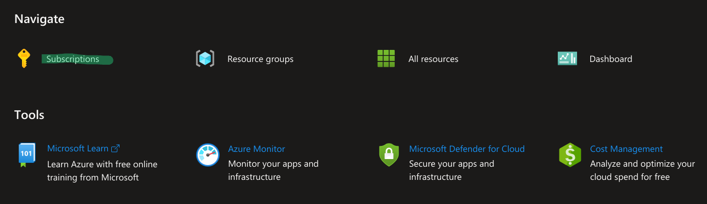
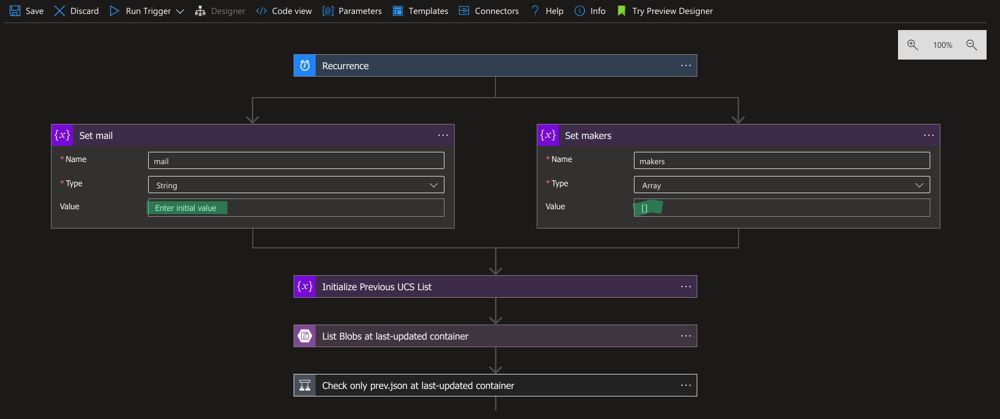

# Tommer

[](https://github.com/infhyroyage/Tommer/actions/workflows/create-azure-resources.yaml)
[](https://github.com/infhyroyage/Tommer/actions/workflows/codeql.yaml)


## Overview

Trace Recent UCS of Specified Makers and Nofiticate the Updates

## Getting Started

### 1. Activate Services

1. Sign up the following two services:
   - [Microsoft Azure](https://azure.microsoft.com) activated with a Microsoft Entra tenant and an Azure subscription.
   - [GitHub](https://github.com)
2. Copy a Microsoft Entra tenant ID and a Azure subscription ID by [official reference](https://learn.microsoft.com/en-us/azure/azure-portal/get-subscription-tenant-id).

### 2. Publish Service Principal and Secret

1. Access [Azure Portal](https://portal.azure.com) and search Microsoft Entra ID:
   
2. Access App Registrations > New registration.
3. Register a service principal by setting the any name and click "Register" button:
   
4. Copy "Application (client) ID" of a registered service principal in the overview.
5. Access Certificates & secrets > New client secret.
6. Register a client secret of a registered service principal by setting the any description and expires and click "Add" button
7. Copy a client secret value:
   

> [!WARNING]
> A client secret value is only displayed immediately after the registration, so keep a copied one at hand.

### 3. Grant Service Principal to Deploy Azure Resources

1. Access [Azure Portal](https://portal.azure.com) and access "Subscription" of "Navigate":
   
2. Access the Azure subscription > Access control (IAM) > Add role assignment.
3. Select "Privileged administrator roles" tab and "Contributor" role, then click "Next" button:
   
4. Select "User, group, or service principal" in "Assign access to", click "Select Members", set and select the name of a service principal, click "Select" button and click "Review + assign" button:
   
5. Click "Review + assign" button.

### 4. Set GitHub Repository

1. Fork this Repository.
2. Access Setting > Secrets And variables > Actions.
3. Click the "New repository secret" button from the "Secrets" tab and set all secrets as follows:
   | Name | Value |
   | ---- | ----- |
   | `AZURE_AD_SP_CONTRIBUTOR_CLIENT_SECRET` | Copied client secret value of service principal |
4. Click the "New repository variable" button from the "Variables" tab and set all variables as follows:
   | Name | Value |
   | ---- | ----- |
   | `AZURE_AD_SP_CONTRIBUTOR_CLIENT_ID` | Copied client ID of service principal |
   | `AZURE_API_CONNECTION_AZUREBLOB` | Name of Azure API Connection with BLOB Storage |
   | `AZURE_API_CONNECTION_OUTLOOK` | Name of Azure API Connection with Outlook.com |
   | `AZURE_APPLICATION_INSIGHTS` | Name of Azure Application Insights |
   | `AZURE_FUNCTIONS` | Name of Azure Function Apps |
   | `AZURE_FUNCTIONS_PLAN` | Name of Azure Function Apps' Plan |
   | `AZURE_LOCATION` | Region of all Azure resources |
   | `AZURE_LOGIC_APP` | Name of Azure Logic Apps |
   | `AZURE_RESOURCE_GROUP` | Name of Azure Resource Group |
   | `AZURE_STORAGE` | Globally unique Name of Azure Storage Account |
   | `AZURE_SUBSCRIPTION_ID` | Copied Azure subscription ID |
   | `AZURE_TENANT_ID` | Copied Microsoft Entra tenant ID |
5. Access Actions and run "Create Azure Resources" workflow.

> [!WARNING]
> After running "Create Azure Resources" workflow, charges will be incurred on Microsoft Azure due to the deployment of Azure resources.

### 5. Update Azure Logic Apps

1. Access [Azure Portal](https://portal.azure.com) and search Logic Apps:
   
2. Access `AZURE_LOGIC_APP` > Logic app designer.
3. Expand boxes named "Set mail" and "Set makers".
4. Set values as follows:
   
   | Name | Description | Example |
   | ---- | ----------- | ------- |
   | Set mail | Notification mail destination when new UCS was changed | `foo@bar.com` |
   | Set makers | An array of the UCS maker names as double-quated strings which you trace and notificate | `["foo", "bar"]` |
5. Expand box named "Check Notification UCS List" > "True" > "Connections" and check the following error message:
   
6. Click the "Invalid" column icon and authentificate by Microsoft Azure account in the new dialog.
7. Check vanishing the error message and the "Invalid" column icon:
   
8. Click "Save" button.
9. Access Overview > Run and click "Run":
   
10. After a while, click "Refresh" and check if the latest "Runs History" status is "Succeeded":
    

## Development

TODO

---

local.settings.json

```json
{
  "IsEncrypted": false,
  "Values": {
    "FUNCTIONS_WORKER_RUNTIME": "node"
  }
}
```

---

## Azure Architecture


| Type                 | Name                             | Description                                           |
| -------------------- | -------------------------------- | ----------------------------------------------------- |
| Resource Group       | `AZURE_RESOURCE_GROUP`           | Resource Group with All Resources                     |
| Logic Apps           | `AZURE_LOGIC_APP`                | Run Functions Apps and Save Recent UCS per 6 hours    |
| API Connection       | `AZURE_API_CONNECTION_AZUREBLOB` | Logic Apps Connection with BLOB Storage               |
| API Connection       | `AZURE_API_CONNECTION_OUTLOOK`   | Logic Apps Connection with Outlook.com                |
| Functions App        | `AZURE_FUNCTIONS`                | Trace and Notificate Recent UCS                       |
| App Service Plan     | `AZURE_FUNCTIONS_PLAN`           | Consumption Plan of Functions App                     |
| Storage Account      | `AZURE_STORAGE`                  | Mount Runtime of Function Apps and Store Previous UCS |
| Application insights | `AZURE_APPLICATION_INSIGHTS`     | Log Function Apps                                     |

## Major Versions

| Name       | Ver.    |
| ---------- | ------- |
| Node.js    | 20.10.0 |
| Playwright | 1.40.1  |
| Typescript | 5.1.6   |

> [!NOTE]
> All npm packages except above are maintained by dependabot in every Monday at 1:00(UTC).

## Logic Apps Architecture

Overall workflow is as follows:


### Reccurrence


Trigger Logic Apps per 6 hours.

### Set mail


Set mail address of user which maintainer want to send.

### Set makers


Set string array of each UCS maker whose UCS maintainer want to trace and notificate.

### Initialize Previous UCS List

TODO

### List Blobs at last-updated container

TODO

### Check only prev.json at last-updated container

TODO

### Get Content of prev.json

TODO

### Parse prev.json

TODO

### Update Previous UCS List

TODO

### Run Functions App

TODO

### Check Response Code of Functions App

TODO

### Terminate

TODO

### Parse Response Body of Functions App

TODO

### Check only prev.json Again at last-updated container

TODO

### Update Content of prev.json

TODO

### Create prev.json

TODO

### Check Notification UCS List

TODO

### Send Mail

TODO

## License

MIT
